### Table of Contents
>[Working with the Paperless Feature](#accessing-l-r-midland-s-groundbreaking-and-integrated-paperless-feature)
  * [Pre-requisites](#pre-requisites)
  * [Connecting to L&R Midland's "Paperless" storage](#connecting-to-l-r-midland-s--paperless--storage)
  * [Exploring and Viewing Files](#exploring-and-viewing-files)
  * [Uploading a file or folder](#uploading-a-file-or-folder)
  * [Downloading a file or folder](#downloading-a-file-or-folder)
  * [Deleting a file or folder](#deleting-a-file-or-folder)

# Accessing L&R Midland's Groundbreaking and Integrated Paperless Feature

L&R Midland's new system is now online! It can be accessed via any browser worldwide via [https://lrmidland.azurewebsites.net](https://lrmidland.azurewebsites.net). The new system also comes with a `Paperless Feature` which stores all files in a secure and managed cloud storage.

This document outlines the steps needed to do basic operations like viewing, downloading and uploading system and user-generated files.

These are the main components of the `Paperless Module`:

| Type | Component | Description |
|------------|------------|------------|
| Interaction | Download | Download file(s) from secure cloud storage |
| Interaction | Upload | Upload file(s) to secure cloud storage |
| Interaction | Delete | Delete file(s) at secure cloud storage |
| Interaction | View | View and list file(s) at secure cloud storage |

## Pre-requisites

In order to proceed, you must have the following:
1. Approval from Chris Haycraft to access L&R Midland's `Paperless Module`
2. Installed and Configured [Azure File Explorer](https://azure.microsoft.com/en-us/products/storage/storage-explorer/) in your local computer
> Contact Chris Haycraft to arrange for an installation and configuration of the software in your local computer.

## Connecting to L&R Midland's "Paperless" storage
| # | Step | Description |
|------------|------------|------------|
| 1| Open Azure File Explorer | <ul><li>Launch and open Azure File Explorer at your local machine.</li>  </li></ul> |
| 2 | Navigate to lrmidlandpaperless File Storage node | <ul><li>Click to expand on `Storage Accounts`</li> <li>Expand `stractlrml` </li><li>Expand `File Shares` </li><li>Double click `lrmidlandpaperless` node to open and explore cloud-based storage </li></ul> View expanded storage explorer for further reference: |

## Exploring and Viewing Files
| # | Step | Description |
|------------|------------|------------|
|1| Navigate to the root folder `LRMidland`| Using the file explorer, double click on LRMidland root folder  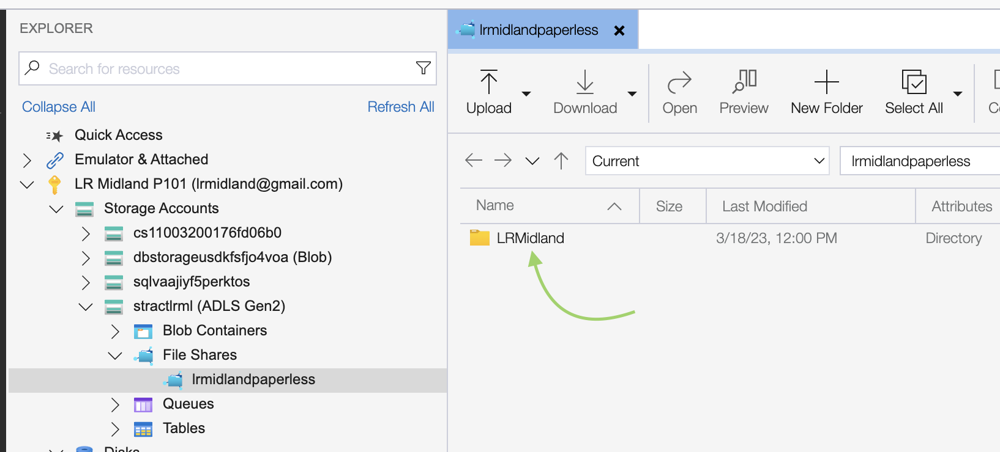|
|2| Folders named after Contract numbers will be shown | 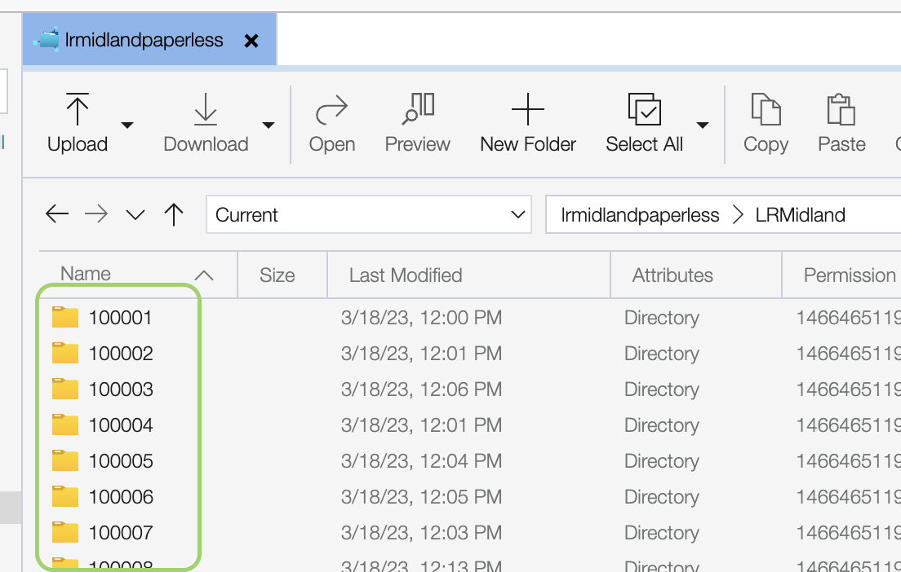 |
|3| Double click on a folder to view the contents within | Each folder will contain 3 main folders <ul><li>Contract</li><li>Miscellaneuous</li><li>Nomination_Confirmation</li></ul> 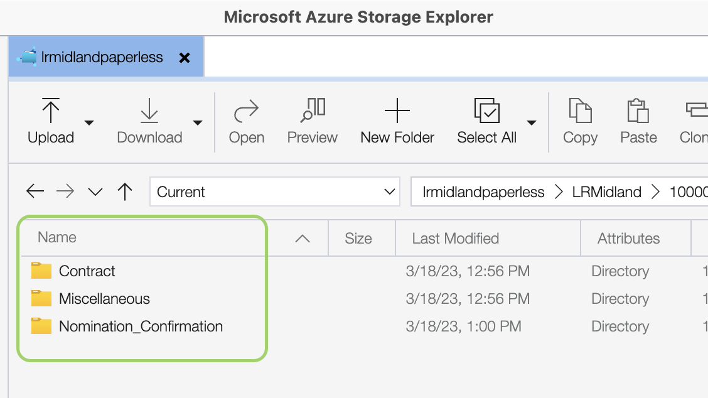|
|4| Folder arrows and breadcrumb navigations | <ul><li>Click on the navigation arrows to move to other folder levels and explore</li><li> You can also use the breadcrumb navigation to move here to and from folders </li></ul> 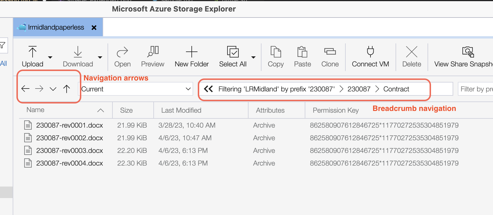|
|5| Using the **Filter by prefix**     You can also search for a file or folder by specifying a search string in this textbox | <ul><li>Go to `LRMidland` root folder and double click on it to reveal all contents 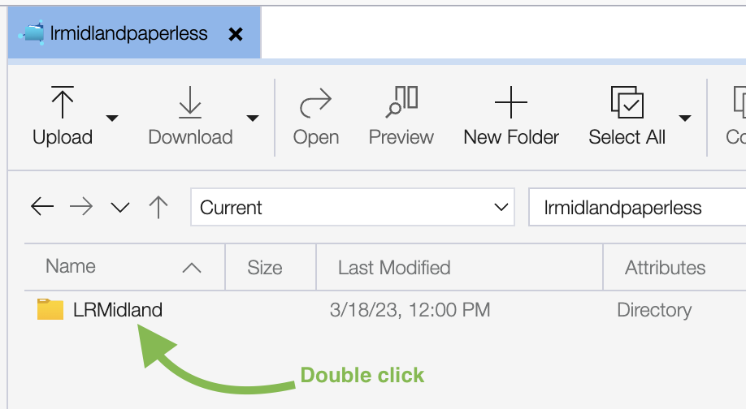</li><li> Enter search string and the display panel will reveal matches if any 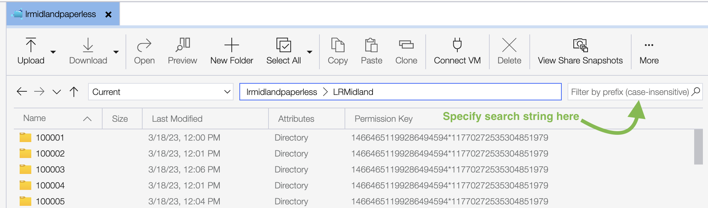 |
|6| Search Result | Rendered search result  |

## Uploading a file or folder
There are two ways to upload files using the file explorer

| # | Step | Description |
|------------|------------|------------|
|1 | Select and Upload | <ul><li>Click on the **Upload** button to begin uploading files or folders to a specific folder</li><li>When the dialog box appears, select the file you wish to upload</li></ul> 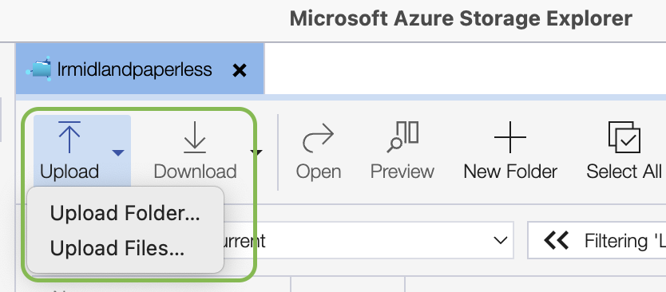 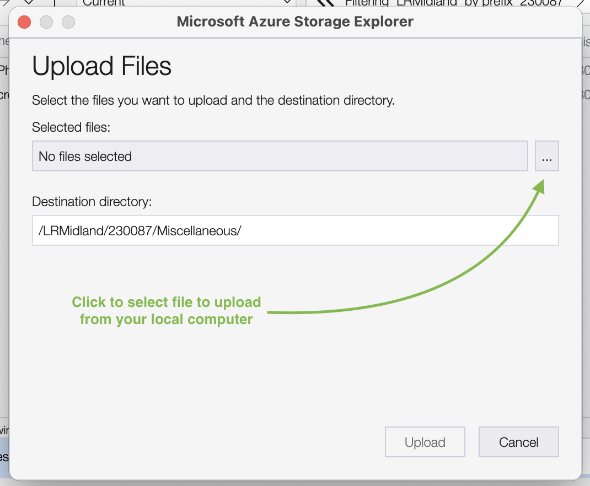|
|2| Drag and Drop|Select the file or files to upload and drag them to the file storage. Note that the file(s) will be uploaded to the folder where you're currently at. 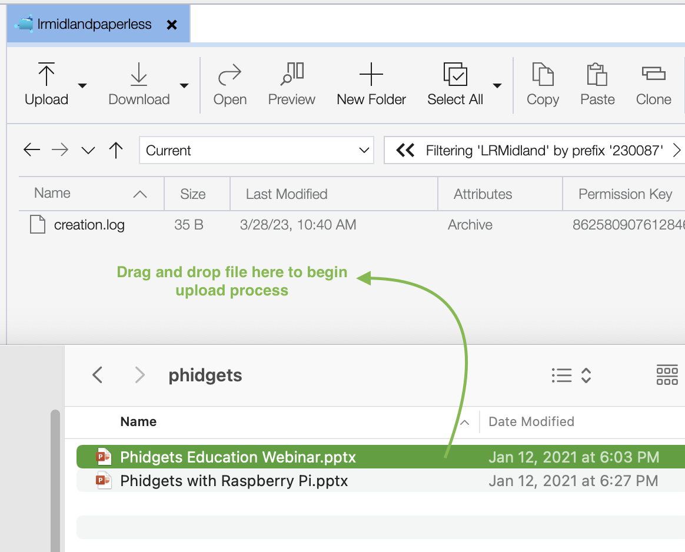    For easier reference, the last node of your **Breadcrumb navigation** is your current folder. 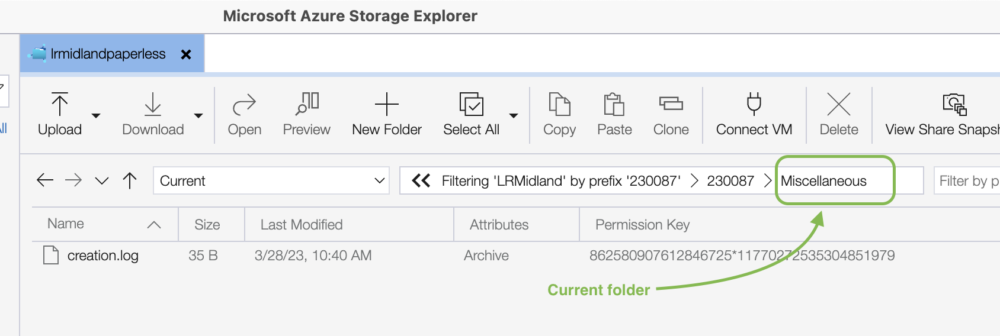|

> NOTE: You can upload a folder or multiple files by selecting them and using either method above.

## Downloading a file or folder
| # | Step | Description |
|------------|------------|------------|
|1|Select file or folder to download | Click download to initiate. A dialog box will appear to ask you where to store the file at your local computer. 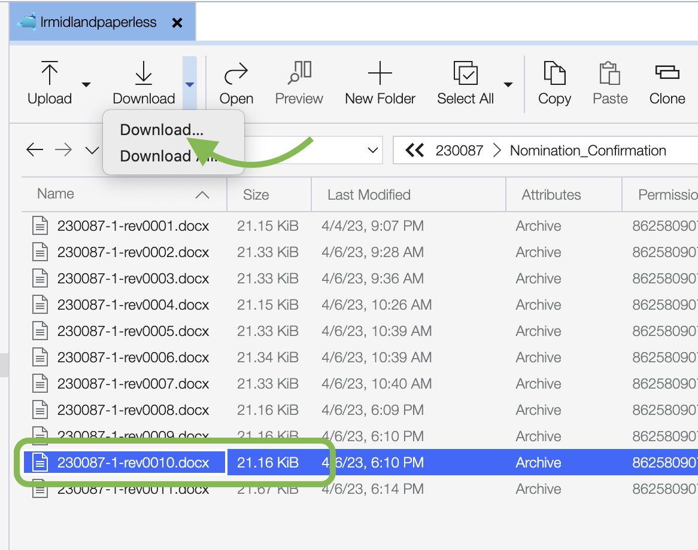|
|2| **Multiple download** download option | Select the files and folders you wish to download then click download to start.  A dialog box will appear to ask you where to store the file at your local computer. 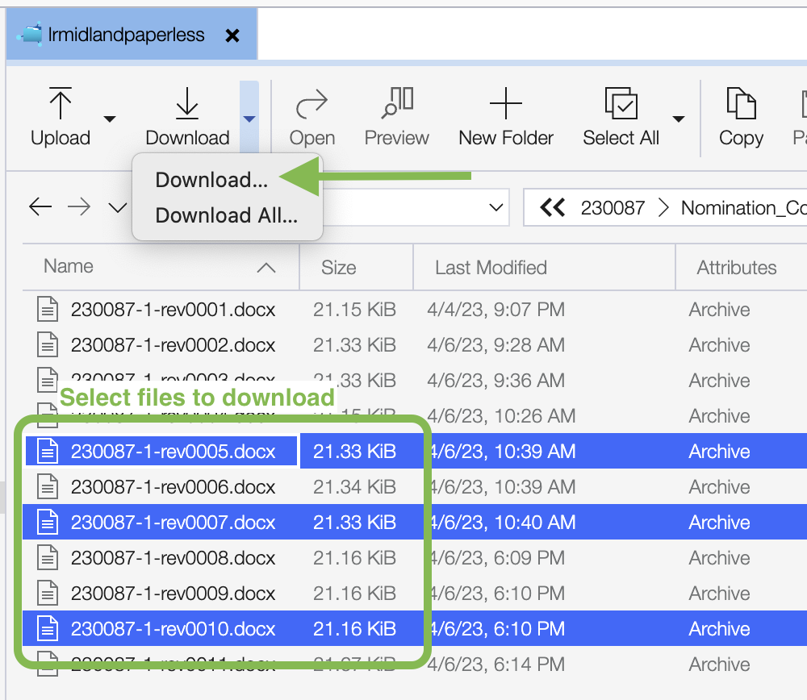|
|3| **Download All** option | This option when used downloads all the files and folders at the current root directory.  In the example below, the "Download All" option will download the entire **230085** folder and its contents.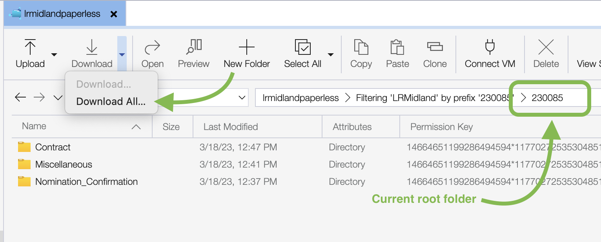 |

## Deleting a file or folder
| # | Step | Description |
|------------|------------|------------|
|1| Deleting a file or folder | Select the file or folder you wish to delete and select **Delete** at the main ribbon menu. 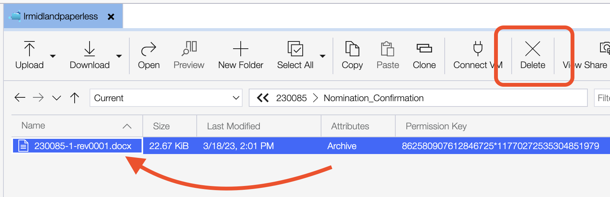|
|2| Delete confirmation dialog | Select **Yes** to confirm deletion or **No** to cancel 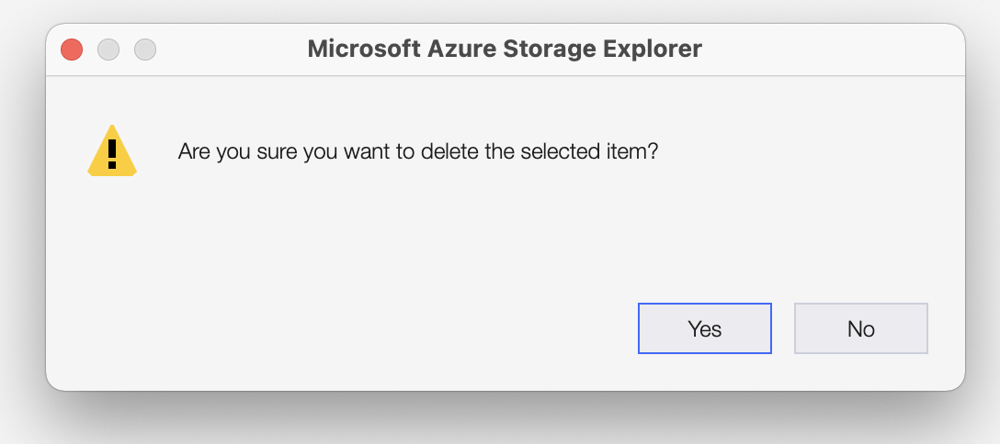|
