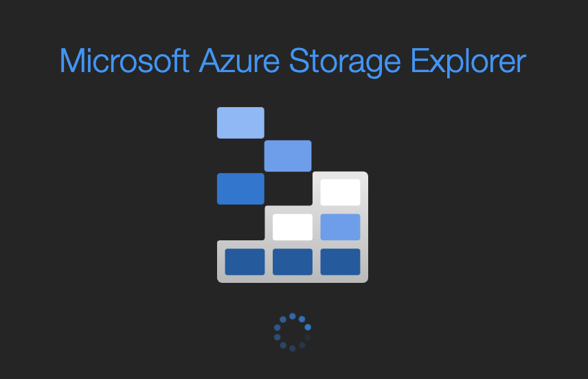

# Accessing L&R Midland's Groundbreaking and Integrated Paperless Feature

L&R Midland's new system is now online! It can be accessed via any browser worldwide via [https://lrmidland.azurewebsites.net](https://lrmidland.azurewebsites.net). The new system also comes with a `Paperless Feature` which stores all files in a secure and managed cloud storage.

This document outlines the steps needed to download system and user-generated files.

These are the main components of the `Paperless Module`:

| Type | Component | Description |
|------------|------------|------------|
| Interaction | Download | Download file(s) from secure cloud storage |
| Interaction | Upload | Upload file(s) to secure cloud storage |
| Interaction | Delete | Delete file(s) at secure cloud storage |
| Interaction | View | View and list file(s) at secure cloud storage |

## Pre-requisites

In order to proceed, you must have the following:
1. Approval from Chris Haycraft to access L&R Midland's `Paperless Module`
2. Installed and Configured [Azure File Explorer](https://azure.microsoft.com/en-us/products/storage/storage-explorer/) in your local computer
> Contact Chris Haycraft to arrange for an installation and configuration of the software in your local computer.

## Connecting to Paperless Feature
| # | Step | Description |
|------------|------------|------------|
| 1| Open Azure File Explorer | <ul><li>Launch and open Azure File Explorer at your local machine.</li>  </li></ul> |
| 2 | Navigate to lrmidlandpaperless File Storage node | <ul><li>Click to expand on `Storage Accounts`</li> <li>Expand `stractlrml` </li><li>Expand `File Shares` </li><li>Double click `lrmidlandpaperless` node to open and explore cloud-based storage </li></ul> View expanded storage explorer for further reference: |

